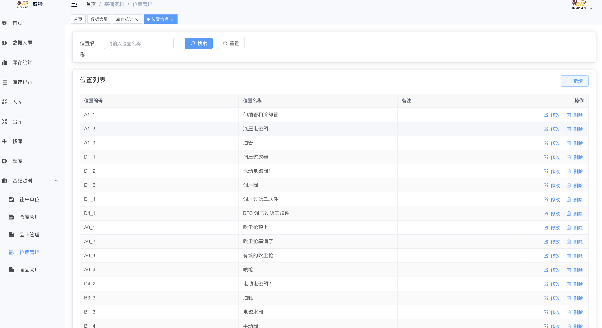
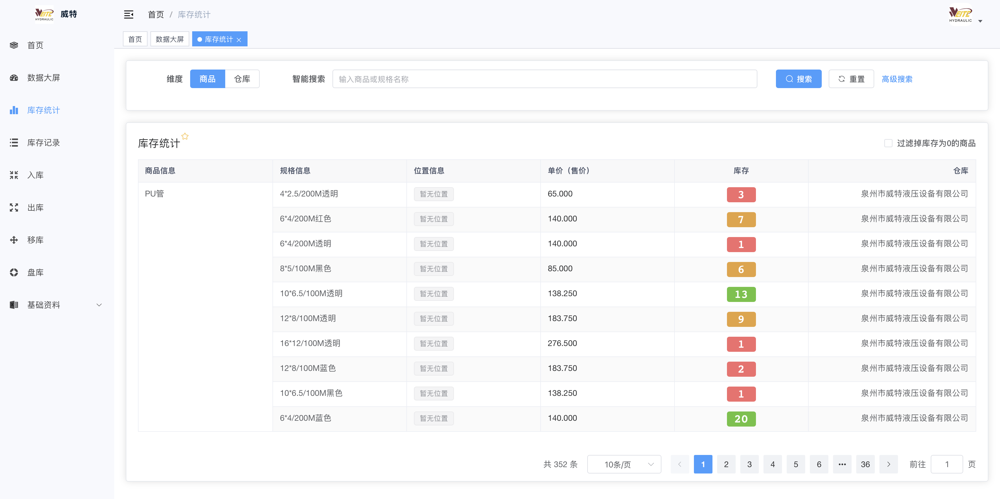

# 威特仓库管理系统前端
> 基于 RuoYi-Vue3 二次开发

## 新增功能
### 1.位置管理
对于仓库中的货位进行管理，支持货位的增删改查

### 2.部分数字高亮
提高数字的可读性

### 3.新增回车、上下左右键支持
在新增和编辑页面，支持回车键保存和搜索，支持上下左右键切换表格

参考 [RuoYi-WMS](https://github.com/zccbbg/wms-ruoyi)